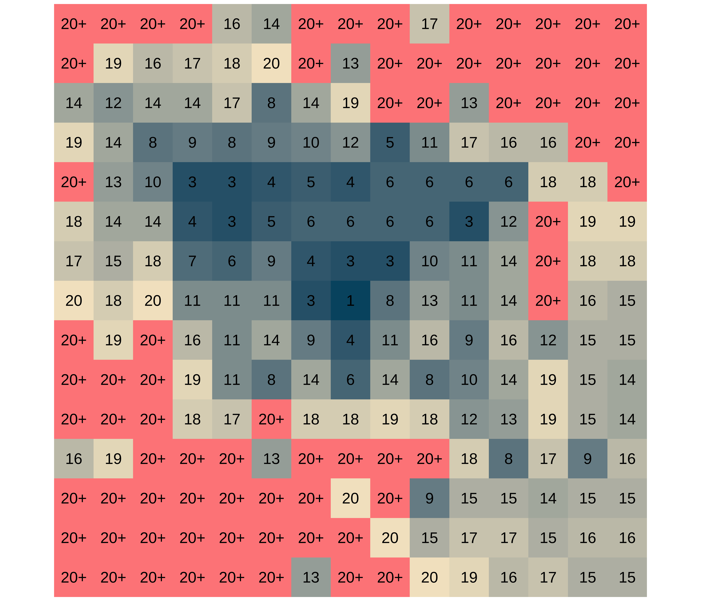

<style>
.list-group-item.active, .list-group-item.active:hover, .list-group-item.active:focus {
background-color: #D21D5C;
border-color: #D21D5C;
}

body {
font-family: FiraSans-Regular;
color: #444444;
font-size: 14px;
}

h1 {
font-weight: bold;
font-size: 28px;
}

h1.title {
font-size: 30px;
color: #D21D5C;
}

h2 {
font-size: 24px;
}

h3 {
font-size: 18px;
}
</style>


# Introduction

Google relies on user proximity to provide local results for keywords. How strong is the proximity factor? How fast does the ranking decrease by distance from the location of a business?  

The goals of the study are to try to estimate the drop in the ranking by geographical distance and to measure the variability due to the local context (city).

## Methods

For this study, we focused on personal injury lawyers in major US cities. We collected 20 top-ranking personal injury lawyers in each of the 50 largest cities. 

For each of these law firms, we used the service [Local Falcon](https://www.localfalcon.com/) to collect Google My Business rankings for listings that show up either in the Maps portion of the organic search or from a search in the Google Maps Local Finder (i.e. Google Maps).

We collected their rankings for the keyword _car accident lawyer_ at 225 locations on a 15x15 grid centered on their geographic location.  

This is an example for the city of Miami:  
{#id .class width=80% height=80%}   

At the location of the law firm, it ranks 1st for the keyword _car accident lawyer_. Its ranking drops, however, as soon we are further away from its location. At the fringe of the grid, the law firm does not appear anymore in the top 20 (its exact ranking is not tracked anymore by Local Falcon).   

This drop in the ranking can vary drastically between law firms, even in the same city. We see this variation if we flank our initial example with 2 other samples from Miami:    
{#id .class width=32% height=32%} {#id .class width=32% height=32%} {#id .class width=32% height=32%}    
On the left, we see a very quick drop in the ranking. On the right, we see the case of a law firm which ranking does not drop much. The grid is always centered on the location of the target law firm.     

To account for this high variation between the firm, we need to collect several samples in each city; we collected 20. We used a radius of 10 miles. This allows us to both highlight the drop in ranking around the exact location of the firm and identify the distance where most of the firms drop out of the top 20. 
Furthermore, for the 10 largest cities, we also collected 10 samples at a 5 miles radius, a finer granularity, to better highlight the drop in ranking around the firm.   

&nbsp;

Most of the 1100 law firms rank 1st at their own location (56%).  



&nbsp;

From the latitude and longitude of each of the 225 measurements on the 15x15 grid, we compute the geographical distance to the location of the target law firm. We then average the ranking of a law firm by mile distance to its own location.  

**There is a major caveat of the data collected with Local Falcon: Local Falcon does not collect rankings above 20** - the first page of search results; they are just collected as "20+". So, in order to numerically estimate the decline in ranking, for instance by computing the average rank at a certain distance from a law firm's localization, we need to impute the value of these missing ranks. For the sake of this study, **we assigned the value of 25 to all "20+" measurements**. This is not perfect and has an impact on the computation of the average ranking. Nevertheless, it still allows us to visualize this decline.   

For instance, with our previous example in Miami, we see that the law firm ranked first at its own location (distance = 0 miles). The ranking drops quickly, and the average position of all the measurements taken between 0 and 1 miles average to ~9. The average rank oscillates then around 20 as from the third mile already. The further away from the location, the more often the firm's ranking is high or out of the top 20, as we used the value of 25 for "+20", this is reflected in the average. The average is in orange when above 20, i.e. where law firms rank mostly out of the top 20.    


To obtain more stable measurements of the drop in ranking, we average the rankings from each law firm. This is the reason why we collected 20 samples per city. 


# Observations

## Rank at Each Mile from Location

We start by visualizing the rank at each mile from the center location for each law firm in each city. Each line is a sample - a law firm.   

First, for the most populated and less populated city:  


Then, for all 50 largest US cities:  


We observe that the patterns are slightly different between cities. There is nevertheless a consistency: the drop in ranking varies greatly between law firms. Some law firms do only see a small drop in their ranking, even at 5 or 10 miles from their location. Other law firms quickly drop out of the top 20 (showed in orange on the plot).    

&nbsp;

Because there is a high variability between the law firms, it is useful to show the __<span style="color:#D21D5C">average rank at each mile</span>__ to highlight the general trend:  


And for all 50 cities:  


The average rank across all law firms is shown in pink. We see that the shape of the average rank by mile is similar between cities: it drops fast in the first mile, and then slowly stabilizes.   

It is computed with a rank of 25 for the firms out of the top 20 and for which the rank is not recorded anymore by Local Falcon. This is distorting the "true" average, which is unknown and likely lower at large miles. Another probable distortion is that the ranking is likely to "continuously" decline, and not stabilize at a certain value. The current impression of stabilization of the mean is due to the constant value of 25 attributed to the "+20" measurements. Nevertheless, our method allows for a visualization of an estimate of the average drop in each city. This estimate is just more precise for smaller distances.     


### Drop from Initial Position (Relative Ranking)

In order to better compare the drop in ranking between law firms and cities, we can visualize their drop from their initial position - the relative ranking. Note that this drop is still computed with a value of 25 for the "+20" measurements.   

First, for the most populated and less populated city:  


Then, for all 50 cities:  


The drop is always 0 at the location of the firms. We observe that the shape of the average drop, despite slight variations, is similar between cities.  

We can superimpose all the drops in one single plot to show **the average drop in ranking in relation to the distance from the location of a firm for each city**:  


```{=html}
<div id="htmlwidget-bf0bbd26752f76ab4375" style="width:100%;height:3150px;" class="girafe html-widget"></div>
<script type="application/json" data-for="htmlwidget-bf0bbd26752f76ab4375">{"x":{"html":"<?xml version=\"1.0\" encoding=\"UTF-8\"?>\n<svg xmlns='http://www.w3.org/2000/svg' xmlns:xlink='http://www.w3.org/1999/xlink' id='svg_731ab66b-ce09-48ff-b5f4-24c2bdd5a563' viewBox='0 0 432.00 360.00'>\n  <g>\n    <defs>\n      <clipPath id='svg_731ab66b-ce09-48ff-b5f4-24c2bdd5a563_cl_1'>\n        <rect x='0.00' y='0.00' width='432.00' height='360.00'/>\n      <\/clipPath>\n    <\/defs>\n    <rect x='0.00' y='0.00' width='432.00' height='360.00' id='svg_731ab66b-ce09-48ff-b5f4-24c2bdd5a563_el_1' clip-path='url(#svg_731ab66b-ce09-48ff-b5f4-24c2bdd5a563_cl_1)' fill='#FFFFFF' fill-opacity='1' stroke='#FFFFFF' stroke-opacity='1' stroke-width='0.75' stroke-linejoin='round' stroke-linecap='round'/>\n    <defs>\n      <clipPath id='svg_731ab66b-ce09-48ff-b5f4-24c2bdd5a563_cl_2'>\n        <rect x='0.00' y='0.00' width='432.00' height='360.00'/>\n      <\/clipPath>\n    <\/defs>\n    <rect x='-0.00' y='0.00' width='432.00' height='360.00' id='svg_731ab66b-ce09-48ff-b5f4-24c2bdd5a563_el_2' clip-path='url(#svg_731ab66b-ce09-48ff-b5f4-24c2bdd5a563_cl_2)' fill='#FFFFFF' fill-opacity='1' stroke='#FFFFFF' stroke-opacity='1' stroke-width='1.16' stroke-linejoin='round' stroke-linecap='round'/>\n    <defs>\n      <clipPath id='svg_731ab66b-ce09-48ff-b5f4-24c2bdd5a563_cl_3'>\n        <rect x='99.02' y='93.23' width='303.09' height='185.29'/>\n      <\/clipPath>\n    <\/defs>\n    <polyline points='99.02,243.62 402.11,243.62' id='svg_731ab66b-ce09-48ff-b5f4-24c2bdd5a563_el_3' clip-path='url(#svg_731ab66b-ce09-48ff-b5f4-24c2bdd5a563_cl_3)' fill='none' stroke='#EAEAEA' stroke-opacity='1' stroke-width='1.28' stroke-linejoin='round' stroke-linecap='butt'/>\n    <polyline points='99.02,196.30 402.11,196.30' id='svg_731ab66b-ce09-48ff-b5f4-24c2bdd5a563_el_4' clip-path='url(#svg_731ab66b-ce09-48ff-b5f4-24c2bdd5a563_cl_3)' fill='none' stroke='#EAEAEA' stroke-opacity='1' stroke-width='1.28' stroke-linejoin='round' stroke-linecap='butt'/>\n    <polyline points='99.02,148.97 402.11,148.97' id='svg_731ab66b-ce09-48ff-b5f4-24c2bdd5a563_el_5' clip-path='url(#svg_731ab66b-ce09-48ff-b5f4-24c2bdd5a563_cl_3)' fill='none' stroke='#EAEAEA' stroke-opacity='1' stroke-width='1.28' stroke-linejoin='round' stroke-linecap='butt'/>\n    <polyline points='99.02,101.65 402.11,101.65' id='svg_731ab66b-ce09-48ff-b5f4-24c2bdd5a563_el_6' clip-path='url(#svg_731ab66b-ce09-48ff-b5f4-24c2bdd5a563_cl_3)' fill='none' stroke='#EAEAEA' stroke-opacity='1' stroke-width='1.28' stroke-linejoin='round' stroke-linecap='butt'/>\n    <polyline points='112.80,278.51 112.80,93.23' id='svg_731ab66b-ce09-48ff-b5f4-24c2bdd5a563_el_7' clip-path='url(#svg_731ab66b-ce09-48ff-b5f4-24c2bdd5a563_cl_3)' fill='none' stroke='#EAEAEA' stroke-opacity='1' stroke-width='1.28' stroke-linejoin='round' stroke-linecap='butt'/>\n    <polyline points='147.24,278.51 147.24,93.23' id='svg_731ab66b-ce09-48ff-b5f4-24c2bdd5a563_el_8' clip-path='url(#svg_731ab66b-ce09-48ff-b5f4-24c2bdd5a563_cl_3)' fill='none' stroke='#EAEAEA' stroke-opacity='1' stroke-width='1.28' stroke-linejoin='round' stroke-linecap='butt'/>\n    <polyline points='181.68,278.51 181.68,93.23' id='svg_731ab66b-ce09-48ff-b5f4-24c2bdd5a563_el_9' clip-path='url(#svg_731ab66b-ce09-48ff-b5f4-24c2bdd5a563_cl_3)' fill='none' stroke='#EAEAEA' stroke-opacity='1' stroke-width='1.28' stroke-linejoin='round' stroke-linecap='butt'/>\n    <polyline points='216.12,278.51 216.12,93.23' id='svg_731ab66b-ce09-48ff-b5f4-24c2bdd5a563_el_10' clip-path='url(#svg_731ab66b-ce09-48ff-b5f4-24c2bdd5a563_cl_3)' fill='none' stroke='#EAEAEA' stroke-opacity='1' stroke-width='1.28' stroke-linejoin='round' stroke-linecap='butt'/>\n    <polyline points='250.57,278.51 250.57,93.23' id='svg_731ab66b-ce09-48ff-b5f4-24c2bdd5a563_el_11' clip-path='url(#svg_731ab66b-ce09-48ff-b5f4-24c2bdd5a563_cl_3)' fill='none' stroke='#EAEAEA' stroke-opacity='1' stroke-width='1.28' stroke-linejoin='round' stroke-linecap='butt'/>\n    <polyline points='285.01,278.51 285.01,93.23' id='svg_731ab66b-ce09-48ff-b5f4-24c2bdd5a563_el_12' clip-path='url(#svg_731ab66b-ce09-48ff-b5f4-24c2bdd5a563_cl_3)' fill='none' stroke='#EAEAEA' stroke-opacity='1' stroke-width='1.28' stroke-linejoin='round' stroke-linecap='butt'/>\n    <polyline points='319.45,278.51 319.45,93.23' id='svg_731ab66b-ce09-48ff-b5f4-24c2bdd5a563_el_13' clip-path='url(#svg_731ab66b-ce09-48ff-b5f4-24c2bdd5a563_cl_3)' fill='none' stroke='#EAEAEA' stroke-opacity='1' stroke-width='1.28' stroke-linejoin='round' stroke-linecap='butt'/>\n    <polyline points='353.89,278.51 353.89,93.23' id='svg_731ab66b-ce09-48ff-b5f4-24c2bdd5a563_el_14' clip-path='url(#svg_731ab66b-ce09-48ff-b5f4-24c2bdd5a563_cl_3)' fill='none' stroke='#EAEAEA' stroke-opacity='1' stroke-width='1.28' stroke-linejoin='round' stroke-linecap='butt'/>\n    <polyline points='388.34,278.51 388.34,93.23' id='svg_731ab66b-ce09-48ff-b5f4-24c2bdd5a563_el_15' clip-path='url(#svg_731ab66b-ce09-48ff-b5f4-24c2bdd5a563_cl_3)' fill='none' stroke='#EAEAEA' stroke-opacity='1' stroke-width='1.28' stroke-linejoin='round' stroke-linecap='butt'/>\n    <polyline points='112.80,101.65 130.02,181.13 147.24,205.57 164.46,220.59 181.68,215.50 198.90,230.10 216.12,213.69 233.34,235.72 250.57,239.43 267.79,258.19 285.01,248.65 319.45,252.64 353.89,255.66' id='svg_731ab66b-ce09-48ff-b5f4-24c2bdd5a563_el_16' clip-path='url(#svg_731ab66b-ce09-48ff-b5f4-24c2bdd5a563_cl_3)' fill='none' stroke='#D21D5C' stroke-opacity='1' stroke-width='1.07' stroke-linejoin='round' stroke-linecap='butt' data-id='New-York' title='New-York'/>\n    <polyline points='112.80,101.65 130.02,170.27 147.24,184.71 164.46,205.27 181.68,210.50 198.90,225.59 216.12,222.13 233.34,224.27 250.57,251.25 267.79,252.47 285.01,260.54 302.23,256.46 319.45,267.99 336.67,262.86' id='svg_731ab66b-ce09-48ff-b5f4-24c2bdd5a563_el_17' clip-path='url(#svg_731ab66b-ce09-48ff-b5f4-24c2bdd5a563_cl_3)' fill='none' stroke='#D21D5C' stroke-opacity='1' stroke-width='1.07' stroke-linejoin='round' stroke-linecap='butt' data-id='Los-Angeles' title='Los-Angeles'/>\n    <polyline points='112.80,101.65 130.02,173.91 147.24,179.82 164.46,165.60 181.68,179.04 198.90,165.16 216.12,178.23 233.34,169.83 250.57,190.06 285.01,194.32 319.45,197.62 353.89,199.23' id='svg_731ab66b-ce09-48ff-b5f4-24c2bdd5a563_el_18' clip-path='url(#svg_731ab66b-ce09-48ff-b5f4-24c2bdd5a563_cl_3)' fill='none' stroke='#D21D5C' stroke-opacity='1' stroke-width='1.07' stroke-linejoin='round' stroke-linecap='butt' data-id='Chicago' title='Chicago'/>\n    <polyline points='112.80,101.65 130.02,159.67 147.24,190.88 164.46,180.16 181.68,189.29 198.90,187.92 216.12,163.89 233.34,231.27 250.57,233.87 267.79,242.12 285.01,239.61 319.45,241.55' id='svg_731ab66b-ce09-48ff-b5f4-24c2bdd5a563_el_19' clip-path='url(#svg_731ab66b-ce09-48ff-b5f4-24c2bdd5a563_cl_3)' fill='none' stroke='#D21D5C' stroke-opacity='1' stroke-width='1.07' stroke-linejoin='round' stroke-linecap='butt' data-id='Miami' title='Miami'/>\n    <polyline points='112.80,101.65 130.02,191.44 147.24,213.27 164.46,210.24 181.68,217.58 198.90,194.84 216.12,209.28 233.34,238.41 267.79,244.52 302.23,249.49 319.45,253.45' id='svg_731ab66b-ce09-48ff-b5f4-24c2bdd5a563_el_20' clip-path='url(#svg_731ab66b-ce09-48ff-b5f4-24c2bdd5a563_cl_3)' fill='none' stroke='#D21D5C' stroke-opacity='1' stroke-width='1.07' stroke-linejoin='round' stroke-linecap='butt' data-id='Dallas' title='Dallas'/>\n    <polyline points='112.80,101.65 130.02,164.16 147.24,174.45 164.46,190.37 181.68,187.00 198.90,194.87 216.12,189.04 233.34,190.11 250.57,214.77 285.01,220.27 319.45,225.21 353.89,227.70' id='svg_731ab66b-ce09-48ff-b5f4-24c2bdd5a563_el_21' clip-path='url(#svg_731ab66b-ce09-48ff-b5f4-24c2bdd5a563_cl_3)' fill='none' stroke='#D21D5C' stroke-opacity='1' stroke-width='1.07' stroke-linejoin='round' stroke-linecap='butt' data-id='Philadelphia' title='Philadelphia'/>\n    <polyline points='112.80,101.65 130.02,185.85 147.24,199.93 164.46,171.28 181.68,204.94 198.90,193.91 216.12,190.49 233.34,233.41 267.79,242.85 285.01,247.82 319.45,252.31' id='svg_731ab66b-ce09-48ff-b5f4-24c2bdd5a563_el_22' clip-path='url(#svg_731ab66b-ce09-48ff-b5f4-24c2bdd5a563_cl_3)' fill='none' stroke='#D21D5C' stroke-opacity='1' stroke-width='1.07' stroke-linejoin='round' stroke-linecap='butt' data-id='Houston' title='Houston'/>\n    <polyline points='112.80,101.65 130.02,213.24 147.24,224.02 164.46,196.99 181.68,225.94 198.90,193.80 216.12,222.82 233.34,227.22 267.79,246.89 302.23,248.79 336.67,254.27' id='svg_731ab66b-ce09-48ff-b5f4-24c2bdd5a563_el_23' clip-path='url(#svg_731ab66b-ce09-48ff-b5f4-24c2bdd5a563_cl_3)' fill='none' stroke='#D21D5C' stroke-opacity='1' stroke-width='1.07' stroke-linejoin='round' stroke-linecap='butt' data-id='Atlanta' title='Atlanta'/>\n    <polyline points='112.80,101.65 130.02,173.65 147.24,178.48 164.46,188.74 181.68,182.68 198.90,179.52 216.12,193.16 233.34,176.37 250.57,204.19 267.79,170.39 285.01,219.89 302.23,187.23 319.45,217.95 336.67,215.20 353.89,203.53 371.11,186.77 388.34,188.67' id='svg_731ab66b-ce09-48ff-b5f4-24c2bdd5a563_el_24' clip-path='url(#svg_731ab66b-ce09-48ff-b5f4-24c2bdd5a563_cl_3)' fill='none' stroke='#D21D5C' stroke-opacity='1' stroke-width='1.07' stroke-linejoin='round' stroke-linecap='butt' data-id='Washington' title='Washington'/>\n    <polyline points='112.80,101.65 130.02,170.48 147.24,178.60 164.46,182.96 181.68,183.92 198.90,184.81 216.12,179.79 233.34,187.72 250.57,187.67 267.79,195.11 285.01,190.47 302.23,195.94 319.45,191.65 336.67,197.72 353.89,193.06' id='svg_731ab66b-ce09-48ff-b5f4-24c2bdd5a563_el_25' clip-path='url(#svg_731ab66b-ce09-48ff-b5f4-24c2bdd5a563_cl_3)' fill='none' stroke='#D21D5C' stroke-opacity='1' stroke-width='1.07' stroke-linejoin='round' stroke-linecap='butt' data-id='Boston' title='Boston'/>\n    <polyline points='112.80,101.65 130.02,160.33 147.24,165.77 164.46,208.63 181.68,208.18 198.90,240.16 216.12,207.53 233.34,226.24 250.57,236.64 267.79,235.60 285.01,250.90 302.23,245.80 319.45,253.25 336.67,252.17' id='svg_731ab66b-ce09-48ff-b5f4-24c2bdd5a563_el_26' clip-path='url(#svg_731ab66b-ce09-48ff-b5f4-24c2bdd5a563_cl_3)' fill='none' stroke='#D21D5C' stroke-opacity='1' stroke-width='1.07' stroke-linejoin='round' stroke-linecap='butt' data-id='Phoenix' title='Phoenix'/>\n    <polyline points='112.80,101.65 130.02,152.52 147.24,157.73 164.46,159.11 181.68,202.96 198.90,184.70 216.12,221.06 233.34,196.25 250.57,209.03 267.79,198.46 285.01,209.69 302.23,202.97 319.45,210.46 336.67,201.43 353.89,210.14 371.11,204.86 388.34,210.35' id='svg_731ab66b-ce09-48ff-b5f4-24c2bdd5a563_el_27' clip-path='url(#svg_731ab66b-ce09-48ff-b5f4-24c2bdd5a563_cl_3)' fill='none' stroke='#D21D5C' stroke-opacity='1' stroke-width='1.07' stroke-linejoin='round' stroke-linecap='butt' data-id='Seattle' title='Seattle'/>\n    <polyline points='112.80,101.65 130.02,166.48 147.24,171.51 164.46,190.66 181.68,193.72 198.90,210.78 216.12,200.28 233.34,211.99 250.57,210.00 267.79,213.33 285.01,210.47 302.23,215.91 319.45,213.54 336.67,216.97 353.89,218.46' id='svg_731ab66b-ce09-48ff-b5f4-24c2bdd5a563_el_28' clip-path='url(#svg_731ab66b-ce09-48ff-b5f4-24c2bdd5a563_cl_3)' fill='none' stroke='#D21D5C' stroke-opacity='1' stroke-width='1.07' stroke-linejoin='round' stroke-linecap='butt' data-id='San-Francisco' title='San-Francisco'/>\n    <polyline points='112.80,101.65 130.02,183.44 147.24,177.59 164.46,211.95 181.68,190.69 198.90,224.07 216.12,197.59 250.57,204.50 285.01,210.22 319.45,214.09 353.89,215.57' id='svg_731ab66b-ce09-48ff-b5f4-24c2bdd5a563_el_29' clip-path='url(#svg_731ab66b-ce09-48ff-b5f4-24c2bdd5a563_cl_3)' fill='none' stroke='#D21D5C' stroke-opacity='1' stroke-width='1.07' stroke-linejoin='round' stroke-linecap='butt' data-id='Detroit' title='Detroit'/>\n    <polyline points='112.80,101.65 130.02,174.76 147.24,181.10 164.46,207.37 181.68,215.06 198.90,245.17 216.12,214.32 233.34,226.91 250.57,227.50 267.79,225.14 285.01,240.31 302.23,229.33 319.45,235.97 336.67,235.65' id='svg_731ab66b-ce09-48ff-b5f4-24c2bdd5a563_el_30' clip-path='url(#svg_731ab66b-ce09-48ff-b5f4-24c2bdd5a563_cl_3)' fill='none' stroke='#D21D5C' stroke-opacity='1' stroke-width='1.07' stroke-linejoin='round' stroke-linecap='butt' data-id='San-Diego' title='San-Diego'/>\n    <polyline points='112.80,101.65 130.02,179.83 164.46,178.06 198.90,179.83 233.34,182.32 267.79,195.52 302.23,199.97 336.67,205.98 371.11,211.09' id='svg_731ab66b-ce09-48ff-b5f4-24c2bdd5a563_el_31' clip-path='url(#svg_731ab66b-ce09-48ff-b5f4-24c2bdd5a563_cl_3)' fill='none' stroke='#D21D5C' stroke-opacity='1' stroke-width='1.07' stroke-linejoin='round' stroke-linecap='butt' data-id='Minneapolis' title='Minneapolis'/>\n    <polyline points='112.80,101.65 130.02,207.80 147.24,218.63 164.46,251.07 181.68,223.46 198.90,218.25 216.12,258.05 233.34,233.43 267.79,243.86 285.01,249.74 319.45,255.58' id='svg_731ab66b-ce09-48ff-b5f4-24c2bdd5a563_el_32' clip-path='url(#svg_731ab66b-ce09-48ff-b5f4-24c2bdd5a563_cl_3)' fill='none' stroke='#D21D5C' stroke-opacity='1' stroke-width='1.07' stroke-linejoin='round' stroke-linecap='butt' data-id='Tampa' title='Tampa'/>\n    <polyline points='112.80,101.65 130.02,174.88 147.24,202.18 164.46,247.36 181.68,215.87 198.90,249.89 216.12,217.81 233.34,249.06 250.57,233.56 285.01,238.89 319.45,241.51 336.67,250.72 353.89,242.94' id='svg_731ab66b-ce09-48ff-b5f4-24c2bdd5a563_el_33' clip-path='url(#svg_731ab66b-ce09-48ff-b5f4-24c2bdd5a563_cl_3)' fill='none' stroke='#D21D5C' stroke-opacity='1' stroke-width='1.07' stroke-linejoin='round' stroke-linecap='butt' data-id='Denver' title='Denver'/>\n    <polyline points='112.80,101.65 130.02,168.26 147.24,200.28 164.46,229.66 181.68,213.07 198.90,244.54 216.12,212.79 233.34,245.69 250.57,233.28 267.79,245.51 285.01,242.23 319.45,245.86 353.89,250.81' id='svg_731ab66b-ce09-48ff-b5f4-24c2bdd5a563_el_34' clip-path='url(#svg_731ab66b-ce09-48ff-b5f4-24c2bdd5a563_cl_3)' fill='none' stroke='#D21D5C' stroke-opacity='1' stroke-width='1.07' stroke-linejoin='round' stroke-linecap='butt' data-id='Brooklyn' title='Brooklyn'/>\n    <polyline points='112.80,101.65 130.02,183.76 147.24,217.71 164.46,249.23 181.68,232.54 198.90,265.12 216.12,234.41 233.34,266.87 250.57,257.23 267.79,264.92 285.01,264.57 319.45,265.97 353.89,270.09' id='svg_731ab66b-ce09-48ff-b5f4-24c2bdd5a563_el_35' clip-path='url(#svg_731ab66b-ce09-48ff-b5f4-24c2bdd5a563_cl_3)' fill='none' stroke='#D21D5C' stroke-opacity='1' stroke-width='1.07' stroke-linejoin='round' stroke-linecap='butt' data-id='Queens' title='Queens'/>\n    <polyline points='112.80,101.65 130.02,151.34 147.24,159.38 164.46,181.34 181.68,191.58 198.90,222.30 216.12,197.64 233.34,218.02 250.57,215.77 267.79,220.72 285.01,234.00 302.23,228.61 319.45,238.06 336.67,237.58' id='svg_731ab66b-ce09-48ff-b5f4-24c2bdd5a563_el_36' clip-path='url(#svg_731ab66b-ce09-48ff-b5f4-24c2bdd5a563_cl_3)' fill='none' stroke='#D21D5C' stroke-opacity='1' stroke-width='1.07' stroke-linejoin='round' stroke-linecap='butt' data-id='Riverside' title='Riverside'/>\n    <polyline points='112.80,101.65 130.02,189.83 147.24,198.96 164.46,229.77 181.68,200.66 198.90,234.35 216.12,214.04 233.34,264.92 250.57,222.84 285.01,227.48 319.45,231.54 336.67,234.00 353.89,238.65' id='svg_731ab66b-ce09-48ff-b5f4-24c2bdd5a563_el_37' clip-path='url(#svg_731ab66b-ce09-48ff-b5f4-24c2bdd5a563_cl_3)' fill='none' stroke='#D21D5C' stroke-opacity='1' stroke-width='1.07' stroke-linejoin='round' stroke-linecap='butt' data-id='Baltimore' title='Baltimore'/>\n    <polyline points='112.80,101.65 130.02,156.31 147.24,172.07 164.46,197.94 181.68,201.44 198.90,229.61 216.12,206.63 233.34,229.97 250.57,217.35 267.79,225.47 285.01,225.75 302.23,224.85 319.45,229.23 336.67,229.62 353.89,230.13' id='svg_731ab66b-ce09-48ff-b5f4-24c2bdd5a563_el_38' clip-path='url(#svg_731ab66b-ce09-48ff-b5f4-24c2bdd5a563_cl_3)' fill='none' stroke='#D21D5C' stroke-opacity='1' stroke-width='1.07' stroke-linejoin='round' stroke-linecap='butt' data-id='Las-Vegas' title='Las-Vegas'/>\n    <polyline points='112.80,101.65 130.02,173.82 147.24,193.69 164.46,187.15 181.68,236.76 198.90,209.66 216.12,244.57 233.34,214.75 250.57,240.54 267.79,219.94 285.01,235.09 302.23,220.52 319.45,232.62 336.67,226.97 353.89,229.13 371.11,229.17 388.34,228.75' id='svg_731ab66b-ce09-48ff-b5f4-24c2bdd5a563_el_39' clip-path='url(#svg_731ab66b-ce09-48ff-b5f4-24c2bdd5a563_cl_3)' fill='none' stroke='#D21D5C' stroke-opacity='1' stroke-width='1.07' stroke-linejoin='round' stroke-linecap='butt' data-id='Portland' title='Portland'/>\n    <polyline points='112.80,101.65 130.02,199.43 147.24,211.34 164.46,236.88 181.68,214.01 198.90,199.53 216.12,231.39 233.34,217.80 267.79,222.12 285.01,223.74 319.45,224.86' id='svg_731ab66b-ce09-48ff-b5f4-24c2bdd5a563_el_40' clip-path='url(#svg_731ab66b-ce09-48ff-b5f4-24c2bdd5a563_cl_3)' fill='none' stroke='#D21D5C' stroke-opacity='1' stroke-width='1.07' stroke-linejoin='round' stroke-linecap='butt' data-id='San-Antonio' title='San-Antonio'/>\n    <polyline points='112.80,101.65 130.02,175.10 147.24,173.58 181.68,177.90 216.12,181.29 250.57,193.54 285.01,204.17 302.23,209.25 336.67,216.41' id='svg_731ab66b-ce09-48ff-b5f4-24c2bdd5a563_el_41' clip-path='url(#svg_731ab66b-ce09-48ff-b5f4-24c2bdd5a563_cl_3)' fill='none' stroke='#D21D5C' stroke-opacity='1' stroke-width='1.07' stroke-linejoin='round' stroke-linecap='butt' data-id='St.-Louis' title='St.-Louis'/>\n    <polyline points='112.80,101.65 130.02,172.63 147.24,174.17 164.46,189.16 181.68,191.30 198.90,204.55 216.12,198.09 233.34,208.52 250.57,206.96 267.79,211.95 285.01,211.53 302.23,218.74 319.45,213.31 336.67,219.06 353.89,218.15' id='svg_731ab66b-ce09-48ff-b5f4-24c2bdd5a563_el_42' clip-path='url(#svg_731ab66b-ce09-48ff-b5f4-24c2bdd5a563_cl_3)' fill='none' stroke='#D21D5C' stroke-opacity='1' stroke-width='1.07' stroke-linejoin='round' stroke-linecap='butt' data-id='Sacramento' title='Sacramento'/>\n    <polyline points='112.80,101.65 130.02,196.71 147.24,203.43 164.46,226.05 181.68,205.59 198.90,195.54 216.12,220.49 233.34,205.52 267.79,208.62 285.01,209.06 319.45,212.01' id='svg_731ab66b-ce09-48ff-b5f4-24c2bdd5a563_el_43' clip-path='url(#svg_731ab66b-ce09-48ff-b5f4-24c2bdd5a563_cl_3)' fill='none' stroke='#D21D5C' stroke-opacity='1' stroke-width='1.07' stroke-linejoin='round' stroke-linecap='butt' data-id='Orlando' title='Orlando'/>\n    <polyline points='112.80,101.65 130.02,174.76 147.24,176.12 164.46,188.11 181.68,188.46 198.90,198.87 216.12,191.17 233.34,199.10 250.57,196.90 267.79,202.96 285.01,195.10 302.23,199.37 319.45,200.60 336.67,199.87 353.89,203.20' id='svg_731ab66b-ce09-48ff-b5f4-24c2bdd5a563_el_44' clip-path='url(#svg_731ab66b-ce09-48ff-b5f4-24c2bdd5a563_cl_3)' fill='none' stroke='#D21D5C' stroke-opacity='1' stroke-width='1.07' stroke-linejoin='round' stroke-linecap='butt' data-id='San-Jose' title='San-Jose'/>\n    <polyline points='112.80,101.65 130.02,166.48 147.24,170.38 164.46,192.64 181.68,176.19 198.90,195.27 216.12,180.35 250.57,192.65 285.01,198.50 319.45,203.46 353.89,206.82' id='svg_731ab66b-ce09-48ff-b5f4-24c2bdd5a563_el_45' clip-path='url(#svg_731ab66b-ce09-48ff-b5f4-24c2bdd5a563_cl_3)' fill='none' stroke='#D21D5C' stroke-opacity='1' stroke-width='1.07' stroke-linejoin='round' stroke-linecap='butt' data-id='Cleveland' title='Cleveland'/>\n    <polyline points='112.80,101.65 130.02,164.49 147.24,166.14 164.46,181.08 181.68,169.02 198.90,187.84 216.12,173.93 250.57,180.54 285.01,182.60 319.45,184.24 353.89,188.55' id='svg_731ab66b-ce09-48ff-b5f4-24c2bdd5a563_el_46' clip-path='url(#svg_731ab66b-ce09-48ff-b5f4-24c2bdd5a563_cl_3)' fill='none' stroke='#D21D5C' stroke-opacity='1' stroke-width='1.07' stroke-linejoin='round' stroke-linecap='butt' data-id='Pittsburgh' title='Pittsburgh'/>\n    <polyline points='112.80,101.65 130.02,191.28 147.24,193.60 164.46,233.33 181.68,200.97 198.90,168.88 216.12,223.92 233.34,204.55 267.79,211.87 285.01,212.03 302.23,222.54 319.45,216.60' id='svg_731ab66b-ce09-48ff-b5f4-24c2bdd5a563_el_47' clip-path='url(#svg_731ab66b-ce09-48ff-b5f4-24c2bdd5a563_cl_3)' fill='none' stroke='#D21D5C' stroke-opacity='1' stroke-width='1.07' stroke-linejoin='round' stroke-linecap='butt' data-id='Austin' title='Austin'/>\n    <polyline points='112.80,101.65 130.02,191.80 147.24,184.85 164.46,211.20 181.68,193.16 216.12,192.08 250.57,199.44 285.01,203.00 319.45,204.69 336.67,208.22' id='svg_731ab66b-ce09-48ff-b5f4-24c2bdd5a563_el_48' clip-path='url(#svg_731ab66b-ce09-48ff-b5f4-24c2bdd5a563_cl_3)' fill='none' stroke='#D21D5C' stroke-opacity='1' stroke-width='1.07' stroke-linejoin='round' stroke-linecap='butt' data-id='Cincinnati' title='Cincinnati'/>\n    <polyline points='112.80,101.65 130.02,200.45 147.24,190.47 164.46,222.68 181.68,194.75 216.12,194.48 250.57,195.71 285.01,200.70 319.45,203.65 336.67,208.25' id='svg_731ab66b-ce09-48ff-b5f4-24c2bdd5a563_el_49' clip-path='url(#svg_731ab66b-ce09-48ff-b5f4-24c2bdd5a563_cl_3)' fill='none' stroke='#D21D5C' stroke-opacity='1' stroke-width='1.07' stroke-linejoin='round' stroke-linecap='butt' data-id='Kansas-City' title='Kansas-City'/>\n    <polyline points='112.80,101.65 130.02,182.37 147.24,179.24 181.68,180.21 216.12,179.13 250.57,183.74 285.01,186.74 319.45,189.51 336.67,165.44 353.89,210.36' id='svg_731ab66b-ce09-48ff-b5f4-24c2bdd5a563_el_50' clip-path='url(#svg_731ab66b-ce09-48ff-b5f4-24c2bdd5a563_cl_3)' fill='none' stroke='#D21D5C' stroke-opacity='1' stroke-width='1.07' stroke-linejoin='round' stroke-linecap='butt' data-id='Indianapolis' title='Indianapolis'/>\n    <polyline points='112.80,101.65 130.02,171.07 147.24,170.68 164.46,207.50 181.68,180.06 216.12,178.74 250.57,185.76 285.01,190.48 319.45,191.80 353.89,196.44' id='svg_731ab66b-ce09-48ff-b5f4-24c2bdd5a563_el_51' clip-path='url(#svg_731ab66b-ce09-48ff-b5f4-24c2bdd5a563_cl_3)' fill='none' stroke='#D21D5C' stroke-opacity='1' stroke-width='1.07' stroke-linejoin='round' stroke-linecap='butt' data-id='Columbus' title='Columbus'/>\n    <polyline points='112.80,101.65 130.02,187.54 147.24,194.80 164.46,229.03 181.68,201.91 216.12,201.33 233.34,193.48 250.57,214.42 267.79,213.03 302.23,216.74 336.67,221.46' id='svg_731ab66b-ce09-48ff-b5f4-24c2bdd5a563_el_52' clip-path='url(#svg_731ab66b-ce09-48ff-b5f4-24c2bdd5a563_cl_3)' fill='none' stroke='#D21D5C' stroke-opacity='1' stroke-width='1.07' stroke-linejoin='round' stroke-linecap='butt' data-id='Charlotte' title='Charlotte'/>\n    <polyline points='112.80,101.65 130.02,165.30 147.24,173.91 164.46,193.85 181.68,180.99 198.90,197.66 216.12,187.59 250.57,195.24 267.79,201.47 285.01,198.90 302.23,203.96 336.67,206.66' id='svg_731ab66b-ce09-48ff-b5f4-24c2bdd5a563_el_53' clip-path='url(#svg_731ab66b-ce09-48ff-b5f4-24c2bdd5a563_cl_3)' fill='none' stroke='#D21D5C' stroke-opacity='1' stroke-width='1.07' stroke-linejoin='round' stroke-linecap='butt' data-id='Virginia-Beach' title='Virginia-Beach'/>\n    <polyline points='112.80,101.65 130.02,177.13 147.24,205.21 164.46,226.75 181.68,214.88 198.90,242.67 216.12,213.35 233.34,246.40 250.57,232.13 267.79,248.00 285.01,239.79 319.45,244.93 353.89,248.71' id='svg_731ab66b-ce09-48ff-b5f4-24c2bdd5a563_el_54' clip-path='url(#svg_731ab66b-ce09-48ff-b5f4-24c2bdd5a563_cl_3)' fill='none' stroke='#D21D5C' stroke-opacity='1' stroke-width='1.07' stroke-linejoin='round' stroke-linecap='butt' data-id='Bronx' title='Bronx'/>\n    <polyline points='112.80,101.65 130.02,183.21 147.24,181.26 181.68,183.25 216.12,183.05 250.57,191.47 285.01,195.25 319.45,199.31 353.89,201.66' id='svg_731ab66b-ce09-48ff-b5f4-24c2bdd5a563_el_55' clip-path='url(#svg_731ab66b-ce09-48ff-b5f4-24c2bdd5a563_cl_3)' fill='none' stroke='#D21D5C' stroke-opacity='1' stroke-width='1.07' stroke-linejoin='round' stroke-linecap='butt' data-id='Milwaukee' title='Milwaukee'/>\n    <polyline points='112.80,101.65 130.02,177.84 147.24,190.57 164.46,210.42 181.68,204.48 198.90,218.16 216.12,188.42 233.34,218.72 250.57,209.17 267.79,221.23 285.01,213.41 302.23,221.26 319.45,216.11 353.89,218.38' id='svg_731ab66b-ce09-48ff-b5f4-24c2bdd5a563_el_56' clip-path='url(#svg_731ab66b-ce09-48ff-b5f4-24c2bdd5a563_cl_3)' fill='none' stroke='#D21D5C' stroke-opacity='1' stroke-width='1.07' stroke-linejoin='round' stroke-linecap='butt' data-id='Providence' title='Providence'/>\n    <polyline points='112.80,101.65 130.02,180.62 147.24,186.81 164.46,202.63 181.68,188.65 198.90,176.68 216.12,197.00 233.34,190.48 267.79,193.57 285.01,193.80 302.23,194.94 319.45,196.67' id='svg_731ab66b-ce09-48ff-b5f4-24c2bdd5a563_el_57' clip-path='url(#svg_731ab66b-ce09-48ff-b5f4-24c2bdd5a563_cl_3)' fill='none' stroke='#D21D5C' stroke-opacity='1' stroke-width='1.07' stroke-linejoin='round' stroke-linecap='butt' data-id='Jacksonville' title='Jacksonville'/>\n    <polyline points='112.80,101.65 130.02,157.02 147.24,169.89 164.46,198.16 181.68,197.18 198.90,212.50 216.12,184.15 233.34,211.82 250.57,194.27 267.79,212.33 285.01,195.66 302.23,208.13 319.45,196.63 353.89,198.14' id='svg_731ab66b-ce09-48ff-b5f4-24c2bdd5a563_el_58' clip-path='url(#svg_731ab66b-ce09-48ff-b5f4-24c2bdd5a563_cl_3)' fill='none' stroke='#D21D5C' stroke-opacity='1' stroke-width='1.07' stroke-linejoin='round' stroke-linecap='butt' data-id='Salt-Lake-City' title='Salt-Lake-City'/>\n    <polyline points='112.80,101.65 130.02,204.00 147.24,201.31 181.68,202.02 216.12,198.09 250.57,205.92 267.79,207.43 302.23,207.62 336.67,211.36' id='svg_731ab66b-ce09-48ff-b5f4-24c2bdd5a563_el_59' clip-path='url(#svg_731ab66b-ce09-48ff-b5f4-24c2bdd5a563_cl_3)' fill='none' stroke='#D21D5C' stroke-opacity='1' stroke-width='1.07' stroke-linejoin='round' stroke-linecap='butt' data-id='Nashville' title='Nashville'/>\n    <polyline points='112.80,101.65 130.02,178.86 147.24,185.83 164.46,205.35 181.68,190.53 198.90,207.77 216.12,194.23 250.57,201.94 267.79,216.60 285.01,202.88 302.23,204.58 319.45,204.70 336.67,205.63' id='svg_731ab66b-ce09-48ff-b5f4-24c2bdd5a563_el_60' clip-path='url(#svg_731ab66b-ce09-48ff-b5f4-24c2bdd5a563_cl_3)' fill='none' stroke='#D21D5C' stroke-opacity='1' stroke-width='1.07' stroke-linejoin='round' stroke-linecap='butt' data-id='Richmond' title='Richmond'/>\n    <polyline points='112.80,101.65 130.02,178.96 147.24,177.67 181.68,180.00 216.12,180.58 233.34,186.53 267.79,189.51 302.23,191.66 336.67,195.55' id='svg_731ab66b-ce09-48ff-b5f4-24c2bdd5a563_el_61' clip-path='url(#svg_731ab66b-ce09-48ff-b5f4-24c2bdd5a563_cl_3)' fill='none' stroke='#D21D5C' stroke-opacity='1' stroke-width='1.07' stroke-linejoin='round' stroke-linecap='butt' data-id='Memphis' title='Memphis'/>\n    <polyline points='112.80,101.65 130.02,174.45 147.24,187.76 164.46,210.82 181.68,193.00 198.90,215.11 216.12,193.91 250.57,203.13 267.79,206.78 285.01,212.86 302.23,211.64 336.67,216.82' id='svg_731ab66b-ce09-48ff-b5f4-24c2bdd5a563_el_62' clip-path='url(#svg_731ab66b-ce09-48ff-b5f4-24c2bdd5a563_cl_3)' fill='none' stroke='#D21D5C' stroke-opacity='1' stroke-width='1.07' stroke-linejoin='round' stroke-linecap='butt' data-id='Raleigh' title='Raleigh'/>\n    <polyline points='112.80,101.65 130.02,170.34 147.24,169.05 181.68,170.02 198.90,168.97 233.34,172.48 267.79,174.02 285.01,173.77 319.45,174.34' id='svg_731ab66b-ce09-48ff-b5f4-24c2bdd5a563_el_63' clip-path='url(#svg_731ab66b-ce09-48ff-b5f4-24c2bdd5a563_cl_3)' fill='none' stroke='#D21D5C' stroke-opacity='1' stroke-width='1.07' stroke-linejoin='round' stroke-linecap='butt' data-id='New-Orleans' title='New-Orleans'/>\n    <polyline points='112.80,101.65 130.02,191.94 147.24,189.95 181.68,193.03 216.12,193.54 250.57,205.56 285.01,212.10 302.23,215.02 336.67,218.29' id='svg_731ab66b-ce09-48ff-b5f4-24c2bdd5a563_el_64' clip-path='url(#svg_731ab66b-ce09-48ff-b5f4-24c2bdd5a563_cl_3)' fill='none' stroke='#D21D5C' stroke-opacity='1' stroke-width='1.07' stroke-linejoin='round' stroke-linecap='butt' data-id='Louisville' title='Louisville'/>\n    <polyline points='112.80,101.65 130.02,178.69 147.24,182.92 164.46,218.48 181.68,187.68 216.12,184.84 233.34,180.78 250.57,189.65 267.79,191.45 302.23,192.29 336.67,194.97' id='svg_731ab66b-ce09-48ff-b5f4-24c2bdd5a563_el_65' clip-path='url(#svg_731ab66b-ce09-48ff-b5f4-24c2bdd5a563_cl_3)' fill='none' stroke='#D21D5C' stroke-opacity='1' stroke-width='1.07' stroke-linejoin='round' stroke-linecap='butt' data-id='Oklahoma-City' title='Oklahoma-City'/>\n    <g clip-path='url(#svg_731ab66b-ce09-48ff-b5f4-24c2bdd5a563_cl_3)'>\n      <text x='295.80' y='237.12' id='svg_731ab66b-ce09-48ff-b5f4-24c2bdd5a563_el_66' font-size='6.40pt' font-family='Helvetica'>Miami<\/text>\n    <\/g>\n    <g clip-path='url(#svg_731ab66b-ce09-48ff-b5f4-24c2bdd5a563_cl_3)'>\n      <text x='353.44' y='184.12' id='svg_731ab66b-ce09-48ff-b5f4-24c2bdd5a563_el_67' font-size='6.40pt' font-family='Helvetica'>Washington<\/text>\n    <\/g>\n    <g clip-path='url(#svg_731ab66b-ce09-48ff-b5f4-24c2bdd5a563_cl_3)'>\n      <text x='358.77' y='274.90' id='svg_731ab66b-ce09-48ff-b5f4-24c2bdd5a563_el_68' font-size='6.40pt' font-family='Helvetica'>Queens<\/text>\n    <\/g>\n    <g clip-path='url(#svg_731ab66b-ce09-48ff-b5f4-24c2bdd5a563_cl_3)'>\n      <text x='360.15' y='239.32' id='svg_731ab66b-ce09-48ff-b5f4-24c2bdd5a563_el_69' font-size='6.40pt' font-family='Helvetica'>Portland<\/text>\n    <\/g>\n    <g clip-path='url(#svg_731ab66b-ce09-48ff-b5f4-24c2bdd5a563_cl_3)'>\n      <text x='282.24' y='169.90' id='svg_731ab66b-ce09-48ff-b5f4-24c2bdd5a563_el_70' font-size='6.40pt' font-family='Helvetica'>New-Orleans<\/text>\n    <\/g>\n    <defs>\n      <clipPath id='svg_731ab66b-ce09-48ff-b5f4-24c2bdd5a563_cl_4'>\n        <rect x='0.00' y='0.00' width='432.00' height='360.00'/>\n      <\/clipPath>\n    <\/defs>\n    <polyline points='99.02,278.51 99.02,93.23' id='svg_731ab66b-ce09-48ff-b5f4-24c2bdd5a563_el_71' clip-path='url(#svg_731ab66b-ce09-48ff-b5f4-24c2bdd5a563_cl_4)' fill='none' stroke='#000000' stroke-opacity='1' stroke-width='1.71' stroke-linejoin='round' stroke-linecap='butt'/>\n    <g clip-path='url(#svg_731ab66b-ce09-48ff-b5f4-24c2bdd5a563_cl_4)'>\n      <text x='72.90' y='246.84' id='svg_731ab66b-ce09-48ff-b5f4-24c2bdd5a563_el_72' font-size='6.75pt' font-weight='bold' font-family='FiraSans-Regular'>-15<\/text>\n    <\/g>\n    <g clip-path='url(#svg_731ab66b-ce09-48ff-b5f4-24c2bdd5a563_cl_4)'>\n      <text x='71.99' y='199.51' id='svg_731ab66b-ce09-48ff-b5f4-24c2bdd5a563_el_73' font-size='6.75pt' font-weight='bold' font-family='FiraSans-Regular'>-10<\/text>\n    <\/g>\n    <g clip-path='url(#svg_731ab66b-ce09-48ff-b5f4-24c2bdd5a563_cl_4)'>\n      <text x='76.95' y='152.19' id='svg_731ab66b-ce09-48ff-b5f4-24c2bdd5a563_el_74' font-size='6.75pt' font-weight='bold' font-family='FiraSans-Regular'>-5<\/text>\n    <\/g>\n    <g clip-path='url(#svg_731ab66b-ce09-48ff-b5f4-24c2bdd5a563_cl_4)'>\n      <text x='79.48' y='104.87' id='svg_731ab66b-ce09-48ff-b5f4-24c2bdd5a563_el_75' font-size='6.75pt' font-weight='bold' font-family='FiraSans-Regular'>0<\/text>\n    <\/g>\n    <polyline points='99.02,278.51 402.11,278.51' id='svg_731ab66b-ce09-48ff-b5f4-24c2bdd5a563_el_76' clip-path='url(#svg_731ab66b-ce09-48ff-b5f4-24c2bdd5a563_cl_4)' fill='none' stroke='#000000' stroke-opacity='1' stroke-width='1.71' stroke-linejoin='round' stroke-linecap='butt'/>\n    <g clip-path='url(#svg_731ab66b-ce09-48ff-b5f4-24c2bdd5a563_cl_4)'>\n      <text x='109.50' y='297.90' id='svg_731ab66b-ce09-48ff-b5f4-24c2bdd5a563_el_77' font-size='6.75pt' font-weight='bold' font-family='FiraSans-Regular'>0<\/text>\n    <\/g>\n    <g clip-path='url(#svg_731ab66b-ce09-48ff-b5f4-24c2bdd5a563_cl_4)'>\n      <text x='144.47' y='297.90' id='svg_731ab66b-ce09-48ff-b5f4-24c2bdd5a563_el_78' font-size='6.75pt' font-weight='bold' font-family='FiraSans-Regular'>2<\/text>\n    <\/g>\n    <g clip-path='url(#svg_731ab66b-ce09-48ff-b5f4-24c2bdd5a563_cl_4)'>\n      <text x='178.63' y='297.90' id='svg_731ab66b-ce09-48ff-b5f4-24c2bdd5a563_el_79' font-size='6.75pt' font-weight='bold' font-family='FiraSans-Regular'>4<\/text>\n    <\/g>\n    <g clip-path='url(#svg_731ab66b-ce09-48ff-b5f4-24c2bdd5a563_cl_4)'>\n      <text x='213.09' y='297.90' id='svg_731ab66b-ce09-48ff-b5f4-24c2bdd5a563_el_80' font-size='6.75pt' font-weight='bold' font-family='FiraSans-Regular'>6<\/text>\n    <\/g>\n    <g clip-path='url(#svg_731ab66b-ce09-48ff-b5f4-24c2bdd5a563_cl_4)'>\n      <text x='247.61' y='297.90' id='svg_731ab66b-ce09-48ff-b5f4-24c2bdd5a563_el_81' font-size='6.75pt' font-weight='bold' font-family='FiraSans-Regular'>8<\/text>\n    <\/g>\n    <g clip-path='url(#svg_731ab66b-ce09-48ff-b5f4-24c2bdd5a563_cl_4)'>\n      <text x='279.69' y='297.90' id='svg_731ab66b-ce09-48ff-b5f4-24c2bdd5a563_el_82' font-size='6.75pt' font-weight='bold' font-family='FiraSans-Regular'>10<\/text>\n    <\/g>\n    <g clip-path='url(#svg_731ab66b-ce09-48ff-b5f4-24c2bdd5a563_cl_4)'>\n      <text x='314.66' y='297.90' id='svg_731ab66b-ce09-48ff-b5f4-24c2bdd5a563_el_83' font-size='6.75pt' font-weight='bold' font-family='FiraSans-Regular'>12<\/text>\n    <\/g>\n    <g clip-path='url(#svg_731ab66b-ce09-48ff-b5f4-24c2bdd5a563_cl_4)'>\n      <text x='348.82' y='297.90' id='svg_731ab66b-ce09-48ff-b5f4-24c2bdd5a563_el_84' font-size='6.75pt' font-weight='bold' font-family='FiraSans-Regular'>14<\/text>\n    <\/g>\n    <g clip-path='url(#svg_731ab66b-ce09-48ff-b5f4-24c2bdd5a563_cl_4)'>\n      <text x='383.28' y='297.90' id='svg_731ab66b-ce09-48ff-b5f4-24c2bdd5a563_el_85' font-size='6.75pt' font-weight='bold' font-family='FiraSans-Regular'>16<\/text>\n    <\/g>\n    <g clip-path='url(#svg_731ab66b-ce09-48ff-b5f4-24c2bdd5a563_cl_4)'>\n      <text x='125.96' y='327.68' id='svg_731ab66b-ce09-48ff-b5f4-24c2bdd5a563_el_86' font-size='8.25pt' font-weight='bold' font-family='FiraSans-Regular'>Distance in miles to the location of the law firm<\/text>\n    <\/g>\n    <g clip-path='url(#svg_731ab66b-ce09-48ff-b5f4-24c2bdd5a563_cl_4)'>\n      <text transform='translate(37.75,237.15) rotate(-90.00)' id='svg_731ab66b-ce09-48ff-b5f4-24c2bdd5a563_el_87' font-size='8.25pt' font-weight='bold' font-family='FiraSans-Regular'>Drop in the ranking<\/text>\n    <\/g>\n    <g clip-path='url(#svg_731ab66b-ce09-48ff-b5f4-24c2bdd5a563_cl_4)'>\n      <text transform='translate(49.63,223.29) rotate(-90.00)' id='svg_731ab66b-ce09-48ff-b5f4-24c2bdd5a563_el_88' font-size='8.25pt' font-weight='bold' font-family='FiraSans-Regular'>(indexed at 0)<\/text>\n    <\/g>\n    <g clip-path='url(#svg_731ab66b-ce09-48ff-b5f4-24c2bdd5a563_cl_4)'>\n      <text x='29.89' y='85.04' id='svg_731ab66b-ce09-48ff-b5f4-24c2bdd5a563_el_89' font-size='7.50pt' font-family='FiraSans-Regular'>Hover on a line to highlight a particular city<\/text>\n    <\/g>\n    <g clip-path='url(#svg_731ab66b-ce09-48ff-b5f4-24c2bdd5a563_cl_4)'>\n      <text x='100.53' y='49.86' id='svg_731ab66b-ce09-48ff-b5f4-24c2bdd5a563_el_90' font-size='10.50pt' font-weight='bold' font-family='FiraSans-Regular'>Average Drop by Mile in each City<\/text>\n    <\/g>\n  <\/g>\n<\/svg>","js":null,"uid":"svg_731ab66b-ce09-48ff-b5f4-24c2bdd5a563","ratio":1.2,"settings":{"tooltip":{"css":".tooltip_SVGID_ { padding:5px;background:black;color:white;border-radius:2px 2px 2px 2px ; position:absolute;pointer-events:none;z-index:999;}\n","offx":10,"offy":0,"use_cursor_pos":true,"opacity":0.9,"usefill":false,"usestroke":false,"delay":{"over":200,"out":500}},"hover":{"css":".hover_SVGID_ { stroke-width:2; }\n","reactive":false},"hoverkey":{"css":".hover_key_SVGID_ { stroke:red; }\n","reactive":false},"hovertheme":{"css":".hover_theme_SVGID_ { fill:green; }\n","reactive":false},"hoverinv":{"css":".hover_inv_SVGID_ { opacity:0.1; }\n"},"zoom":{"min":1,"max":1},"capture":{"css":".selected_SVGID_ { fill:red;stroke:gray; }\n","type":"multiple","only_shiny":true,"selected":[]},"capturekey":{"css":".selected_key_SVGID_ { stroke:gray; }\n","type":"single","only_shiny":true,"selected":[]},"capturetheme":{"css":".selected_theme_SVGID_ { stroke:gray; }\n","type":"single","only_shiny":true,"selected":[]},"toolbar":{"position":"topright","saveaspng":true,"pngname":"diagram"},"sizing":{"rescale":true,"width":1}}},"evals":[],"jsHooks":[]}</script>
```

Note that, again, the average is computed with a constant value of "25" for the samples out of the top 20. This explains the stabilization of the curve at large distances. Nevertheless, all cities see a drop of -5 to -12 in the average ranking of the law firms in the first mile. The drop seems to be larger in the Queens than in New Orleans.    


### The Drop Follows a Rule of Exponential Decay

As we just saw, the drop in terms of ranking has a similar shape in all cities. The drop seems to follow more or less a rule of [exponential decay](https://en.wikipedia.org/wiki/Exponential_decay): it decreases at a rate proportional to its current value. At first, it decreases fast and then reaches stability.  

The _exponential decay function_ can be formalized like this:   

$Drop(d) = (Drop0 - DropFinal)* e^{-λd} + DropFinal$  

Where $Drop(d)$ is the drop at a distance $d$ and $λ$ is the decay constant. $Drop0$ is the intercept, the drop at distance 0. The parameter $DropFinal$ is included as a "correction" because we work with negative values (the drops in position are encoded as "-1", "-2", etc.).  

When fitting an _exponential decay function_ to the average, we estimate $λ$. If we have an estimate of $λ$, we can use the _exponential decay function_ to estimate the drop which would be expected, on average, at a certain distance $d$.  

We start by illustrating the decay with all the samples taken in all cities, together. In order to get a better estimate of the exponential decay function, we average the data each tenth of a mile. In pink, we see the average drop in ranking regardless of the city:   


Then we can fit an _exponential decay function_ to the average, in green:   


An _exponential decay function_ fits the average drop very well. The _decay constant_ $λ$ estimated by the fit is 2.3. The other two constants are estimated as $Dropfinal$ = -11.9 and $Drop0$ = -2.1. Note that the estimated drop at a distance of 0 mile is thus -2.1, which is not perfect as we know that it should be 0.   

We could use it to estimate the expected drop in ranking at any distance for an average law firm. For instance, the estimated drop at 1000 yards (0.59 mile) would be of $Drop(0.59) = (-2.1 + 11.9)* e^{-2.3 * 0.59}) - 11.9$ = -9.4 positions.  

This is just an estimate based on an average. We see on the plots above that in reality law firms drop following all sort of trajectories, as illustrated by the plot being "filled" by black lines between 0 and -20. Note also that the caveat of having imputed missing "+20" measurements with the constant value of 25 is impacting the average and thus the fit, especially the final stabilized value of -11.9 for the drop.  

Nevertheless, it is possible to fit such an exponential decay function separately for the averages in all cities. It would allow us to compute predictions of what the typical drop would look like in each city.     

For simplicity, here is the same plot showing only the average on all law firms and the _exponential decay_ fit:  


## When are Law Firms Dropping Out of the Top 20?

Google Maps shows 20 results on the first search page and Local Falcon does not collect the ranking above the top 20. We saw above that the ranking was dropping fast in the first mile, but also that not all the firms were dropping out of the top 20 after 10 miles. And this, in all cities, regardless of their area.  

For example, a 10-mile radius is enough to completely cover the city of Boston and its surroundings, but this is absolutely not the case in Los Angeles. However, in both cases, we identify companies that fall out of the top 20 after 5 or 10 miles and others that do not fall out of the top 20.  

**How does the proportion of law firms out of the top 20 change with distance?**   

We first have a look at New-York and Oklahoma-City:  


There is a radical difference here. The percentage of law firms that dropped out of the top 20 rises to 80% in New York, after around 10 miles. Whereas in Oklahoma city, this number never rises above 30%; a larger proportion of law firms rank well, even at large distances.   

The same figure, for all the 50 largest U.S. cities:  


The percentage of law firms that dropped out of the top 20 at the largest distance ranges from 27% in Pittsburgh to 92% in Queens. 

The cities are ordered by population size. It seems that the percentage of law firms that are able to remain in the top 20 is lower in the largest cities.    

__This measure is likely an estimate of the competition in each city.__   

Note that these percentages are computed on 20 sample law firms. Please note also that the largest distance is not exactly the same in all cities. These differences are due to the precision of Local Falcon, geolocalization, and computation of geographical distance from coordinates. 


# Summary and Key Observations

We sampled 20 personal injury law firms in the 50 largest U.S. cities. For each, we measured their ranking for the keyword "car accident lawyer" at 225 locations disposed on a squared grid of 10 miles "radius" around the original location of the firm, using Local Falcon (+ 10 samples with a radius of 5 miles for the 10 largest cities).   

We then compute the rankings and relative ranking (drop) of each law firm for each mile away from its location, as well as the percentage of the firms dropping out of the top 20 positions.  

## Key Observations 

1. __The ranking drops dramatically in the first mile__; in all cities. On average, the drop in ranking in the first mile is -8 positions.   

2. __The drop in ranking varies greatly between law firms. Some top-ranking firms do not even see a drop__ in the 10-mile radius. This means that there is probably no distance that would guarantee that all of the law firms in a given city drop out of the top 20. __On the other hand, some law firms drop very quickly out of the top 20__. Often, these are firms that already did not rank 1st at their own location.        

3. After the quick drop, the average ranking stabilizes or decreases much slower. This effect is partly due to observation 2: we compute an average between law firms still ranking well and law firms which ranking is imputed to 25 because they are out of the top 20. This effect, albeit with some slight variations, is seen in all cities.  

4. This drop in the ranking is following an _exponential decay rule_, and this rule could be used to estimate the expected drop for any firm in any city at any distance. Caveats: in reality, the variance between the law firms is very large and this just an estimate of their average. Furthermore, this rule is based on imputing the value 25 to the "+20" ranks.         

5. __The percentage of law firms that dropped out of the top 20 for each mile distance varies a lot between cities__. In most cities, the largest increase of law firms dropping out of the top 20 is taking place in the first mile. The maximum of companies out of the top 20 varies dramatically between cities, ranging from 27% in Pittsburgh to 92% in Queens. These percentages can be used to estimate the probability of a law firm to rank in (or out) of the top 20 in each city, at each mile. __These results are likely a reflection of the competition among personal injury lawyers in each city__.   

All these observations might have an impact on the current Rankings.io offer of a 5-mile geographic radius around a client’s headquarters to take more than one client in larger cities. They also show the benefit of opening several offices in large cities, as the ranking is dropping fast by distance.    


