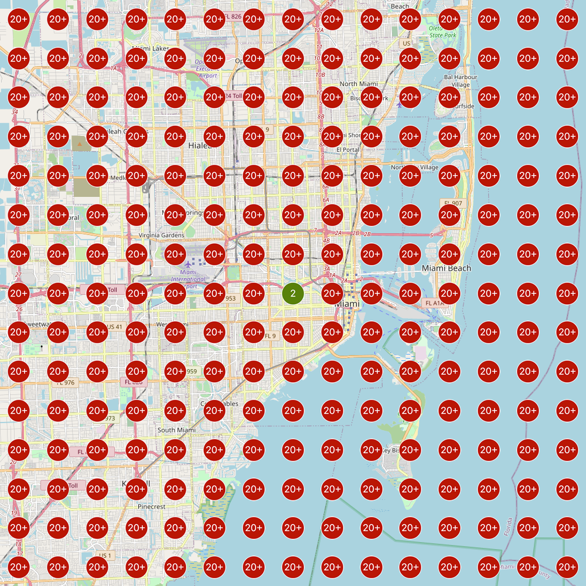

<style>
.list-group-item.active, .list-group-item.active:hover, .list-group-item.active:focus {
background-color: #D21D5C;
border-color: #D21D5C;
}

body {
font-family: FiraSans-Regular;
color: #444444;
font-size: 14px;
}

h1 {
font-weight: bold;
font-size: 28px;
}

h1.title {
font-size: 30px;
color: #D21D5C;
}

h2 {
font-size: 24px;
}

h3 {
font-size: 18px;
}
</style>


```{r setup, include=FALSE}
knitr::opts_chunk$set(warning = FALSE, message = FALSE, 
                      fig.showtext = TRUE, dpi = 700,
                      echo = FALSE # hide code for now
)

knitr::knit_hooks$set(inline = function(x) {
  prettyNum(x, big.mark = ",", small.mark = ",", scientific = F)
})

Sys.setlocale("LC_TIME", "C")
# extrafont::loadfonts(device = "win")
extrafont::loadfonts()

```


```{r prep}
# SETUP

## packages: remove or add your necessary packages

# required_packages <- c("tidyverse", "readxl", "ggthemes", "hrbrthemes", "extrafont", "plotly", "scales", "stringr", "gganimate", "here", "tidytext", "sentimentr", "scales", "DT", "here", "sm", "mblm", "glue", "fs", "knitr", "rmdformats", "janitor", "urltools", "colorspace", "pdftools", "showtext")

required_packages <- c("tidyverse", "extrafont", "here", "colorspace", "pdftools", "kableExtra")

for(i in required_packages) { 
  if(!require(i, character.only = T)) {
    
    #  if package is not existing, install then load the package
    install.packages(i, dependencies = T)
    require(i, character.only = T)
  }
}


## save plots?
save <- TRUE
#save <- FALSE

## quality of png's
dpi <- 750

## font adjust; please adjust to client´s website
#extrafont::loadfonts(device = "win", quiet = TRUE)
#font_add_google("Montserrat", "Montserrat")
# font_add_google("Overpass", "Overpass")
# font_add_google("Overpass Mono", "Overpass Mono")


## theme updates; please adjust to client´s website
#theme_set(ggthemes::theme_clean(base_size = 15))
theme_set(ggthemes::theme_clean(base_size = 15, base_family = "FiraSans-Regular"))


theme_update(plot.margin = margin(30, 30, 30, 30),
             plot.background = element_rect(color = "white",
                                            fill = "white"),
             plot.title = element_text(size = 20,
                                       face = "bold",
                                       lineheight = 1.05,
                                       hjust = .5,
                                       margin = margin(10, 0, 25, 0)),
             plot.title.position = "plot",
             plot.caption = element_text(color = "grey40",
                                         size = 9,
                                         margin = margin(20, 0, -20, 0)),
             plot.caption.position = "plot",
             axis.line.x = element_line(color = "black",
                                        size = .8),
             axis.line.y = element_line(color = "black",
                                        size = .8),
             axis.title.x = element_text(size = 16,
                                         face = "bold",
                                         margin = margin(t = 20)),
             axis.title.y = element_text(size = 16,
                                         face = "bold",
                                         margin = margin(r = 20)),
             axis.text = element_text(size = 11,
                                      color = "black",
                                      face = "bold"),
             axis.text.x = element_text(margin = margin(t = 10)),
             axis.text.y = element_text(margin = margin(r = 10)),
             axis.ticks = element_blank(),
             panel.grid.major.x = element_line(size = .6,
                                               color = "#eaeaea",
                                               linetype = "solid"),
             panel.grid.major.y = element_line(size = .6,
                                               color = "#eaeaea",
                                               linetype = "solid"),
             panel.grid.minor.x = element_line(size = .6,
                                               color = "#eaeaea",
                                               linetype = "solid"),
             panel.grid.minor.y = element_blank(),
             panel.spacing.x = unit(4, "lines"),
             panel.spacing.y = unit(2, "lines"),
             legend.position = "top",
             legend.title = element_text(family = "Montserrat",
                                         color = "black",
                                         size = 14,
                                         margin = margin(5, 0, 5, 0)),
             legend.text = element_text(family = "Montserrat",
                                        color = "black",
                                        size = 11,
                                        margin = margin(4.5, 4.5, 4.5, 4.5)),
             legend.background = element_rect(fill = NA,
                                              color = NA),
             legend.key = element_rect(color = NA, fill = NA),
             #legend.key.width = unit(5, "lines"),
             #legend.spacing.x = unit(.05, "pt"),
             #legend.spacing.y = unit(.55, "pt"),
             #legend.margin = margin(0, 0, 10, 0),
             strip.text = element_text(face = "bold",
                                       margin = margin(b = 10)))

## theme settings for flipped plots
theme_flip <-
  theme(panel.grid.minor.x = element_blank(),
        panel.grid.minor.y = element_line(size = .6,
                                          color = "#eaeaea"))

## theme settings for maps
theme_map <- 
  theme_void(base_family = "Montserrat") +
  theme(legend.direction = "horizontal",
        legend.box = "horizontal",
        legend.margin = margin(10, 10, 10, 10),
        legend.title = element_text(size = 17, 
                                    face = "bold"),
        legend.text = element_text(color = "grey33",
                                   size = 12),
        plot.margin = margin(15, 5, 15, 5),
        plot.title = element_text(face = "bold",
                                  size = 20,
                                  hjust = .5,
                                  margin = margin(30, 0, 10, 0)),
        plot.subtitle = element_text(face = "bold",
                                     color = "grey33",
                                     size = 17,
                                     hjust = .5,
                                     margin = margin(10, 0, -30, 0)),
        plot.caption = element_text(size = 14,
                                    color = "grey33",
                                    hjust = .97,
                                    margin = margin(-30, 0, 0, 0)))

## numeric format for labels
num_format <- scales::format_format(big.mark = ",", small.mark = ",", scientific = F)

## main color backlinko
bl_col <- "#00d188"
bl_dark <- darken(bl_col, .3, space = "HLS")

## colors + labels for interval stripes
int_cols <- c("#bce2d5", "#79d8b6", bl_col, "#009f66", "#006c45", "#003925")
int_perc <- c("100%", "95%", "75%", "50%", "25%", "5%")

## colors for degrees (Bachelors, Massters, Doctorate in reverse order)
cols_degree <- c("#e64500", "#FFCC00", darken(bl_col, .1))

## gradient colors for position
colfunc <- colorRampPalette(c(bl_col, "#bce2d5"))
pos_cols <- colfunc(10)
```


```{r}

# DATA LOADING

samples <- rio::import(here::here("proc_data", "samples_10cities_20samples.rds")) %>%
  mutate(
    geodist_miles = round(geodist * 0.62137119224, 2), # the distance in American miles instead of km
    drop = -drop # we want the drop to be negative
  )

```


```{r}

# DATA PROCESSING
#   we need an easy way to plot the distance to origin for the plots.
#   so, we bin the distance by mile, an compute the average rank in a bin.
# we create 2 tibbles, one with an average by city
# and another with an average by city and sample.

# method: because the geo distance varies, and is not the EXACT same
# btw cities and samples, we bin by mile to plot.

# a tibble with an average by city
avg_by_city <- samples %>%
  mutate(
    rough_geodist = cut(geodist_miles, breaks = seq(0, max(samples$geodist_miles)+1), labels = FALSE), # bin by m ile 
    rough_geodist = ifelse(is.na(rough_geodist), 0, rough_geodist) # the bin 0 is 0 instead of NA
  ) %>%
  group_by(City, rough_geodist) %>%
  summarise(avg_drop = mean(drop),
            n_samples = n(),
            sd = sd(drop),
            avg_rank = mean(rank),
            n_samples_out_of_top20 = sum(rank > 20)
  ) %>%
  ungroup() %>%
  mutate(
    percentage_out_of_top20 = (n_samples_out_of_top20 / n_samples)
  )

# a tibble with an average by city and sample
avg_by_city_and_firm <- samples %>%
  mutate(
    rough_geodist = cut(geodist_miles, breaks = seq(0, max(samples$geodist_miles)+1), labels = FALSE), # bin by mile 
    rough_geodist = ifelse(is.na(rough_geodist), 0, rough_geodist) # the bin 0 is 0 instead of NA
  ) %>%
  group_by(City, Sample, rough_geodist) %>%
  summarise(avg_drop = mean(drop),
            avg_rank = mean(rank),
            n_samples = n(),
            n_samples_out_of_top20 = sum(rank > 20)
  ) %>%
  ungroup() %>%
  mutate(
    percentage_out_of_top20 = (n_samples_out_of_top20 / n_samples)
  )

```


# Summary

not sure if keeping this...  

# Introduction

Google relies on user proximity to provide local results for keywords. How strong is the proximity factor? How fast does the ranking decrease by distance from the location of a business?  

The goals of the study are to try to estimate the drop in the ranking by geographical distance and to measure the variability due to the local context.

## Methods

For this study, we focused on personal injury lawyers in major US cities. We collected 20 top ranking personal injury lawyers in each of the 10 largest cities. 

For each of these law firm, we used the service [Local Falcon](https://www.localfalcon.com/) to collect Google My Business rankings for listings that show up either in the Maps portion of the organic search, or from a search in the Google Maps Local Finder (i.e. Google Maps).

We collected their rankings for the keyword _car accident lawyer_ at 225 locations on a 15x15 grid centered on their geographic location.  

This is an example for the city of Miami:  
{#id .class width=80% height=80%}   

At the location of the law firm, it ranks 1st for the keyword _car accident lawyer_. Its ranking drops, however, as soon we are further away from its location. At the fringe of the grid, the law firm does not appear anymore in the top 20 (its exact ranking is not tracked anymore by Local Falcon).   

This drop in the ranking can vary drastically between law firms, even in the same city. We see this variation if we flank our initial example with 2 other samples from Miami:    
{#id .class width=32% height=32%} {#id .class width=32% height=32%} {#id .class width=32% height=32%}    
On the left, we see a very quick drop in the ranking. On a the right, we see the case of a law firm which ranking does not drop much. The grid is always centered on the location of the target law firm.     

To account for this high variation between the firm, we need to collect several samples in each city: 20. For 10 law firms, we used a radius of 5 miles, a finer granularity to better highlight the drop in ranking around the exact location of the firm. For 10 other law firms, we used a radius of 10 miles, to better identify the distance where most of the firms drop out of the top 20.  

&nbsp;

Most of the 200 law firms rank 1st at their own location (58%).  

```{r, fig.align='center', fig.height=5, out.width='80%'}

avg_by_city_and_firm %>% 
  filter(rough_geodist == 0) %>%
  count(avg_rank) %>%
  mutate(initial_rank_in_perc = n/sum(n)) %>%
  ggplot(aes(x = avg_rank, y = initial_rank_in_perc)) +
  geom_col() +
  scale_y_continuous(labels = scales::percent) +
  xlab("Rank at own location") +
  ylab("Percentage of law firms")

```

&nbsp;

From the latitude and longitude of each of the 225 measurements on the 15x15 grid, we compute the geographical distance to the location of the target law firm. We then average the ranking of a law firm by mile to its own location.  

For instance, with our previous example in Miami, we see that the law firm ranked first at its own location (distance = 0 miles). The ranking drops quickly, and the average position of all the measurements taken between 0 and 1 miles average to ~9. The average rank stabilizes then around 18.      

```{r, fig.align='center', fig.height=5, out.width='80%'}

avg_by_city_and_firm %>% 
  filter(City == "Miami",
         Sample == "12") %>%
  ggplot(mapping = aes(x = rough_geodist, y = avg_rank)) +
  geom_point() +
  geom_line() + 
  scale_y_reverse(
    breaks = seq(1,round(max(avg_by_city_and_firm$avg_rank)), by = 2)
  ) +
  # scale_y_reverse() +
  scale_x_continuous(
    breaks = seq(0,max(avg_by_city_and_firm$rough_geodist), by = 1), 
    minor_breaks = NULL) + 
  # labs(
  #   title = "The average drop in position",
  #   subtitle = "The ranking drops dramatically in the first mile. Distances are binned by mile."
  # ) +
  xlab("Distance in miles to the location of the law firm") +
  ylab("Ranking\n(average, binned by mile)") +
  annotate(geom = "text", x=4, y=1, 
           label="This firm ranks 1st at its location (0 miles)...") +
  annotate(geom = "text", x=5.5, y=9, 
           label="... and quickly ranks, on average, 9th after 1 mile.")

```


We are then able to compute the average drop in the ranking in function of the distance to its initial ranking for any law firm.  

--- insert plot example with drop.  ---


# Observations


Average drop by city:  

```{r}


average_drop <- ggplot(data = avg_by_city, mapping = aes(x = rough_geodist, y = avg_drop, group = 1)) +
  geom_point() +
  geom_line() +
  # geom_errorbar(aes(ymin = avg_drop - sd, ymax = avg_drop + sd)) + 
  facet_wrap(vars(City), ncol = 5) + 
  scale_y_continuous(
    breaks = seq(0,round(min(avg_by_city$avg_drop)), by = -2)
  ) + 
  scale_x_continuous(
    breaks = seq(0,max(avg_by_city$rough_geodist), by = 2), 
    minor_breaks = NULL 
  ) + 
  labs(
    title = "The average drop in position",
    subtitle = "The ranking drops dramatically in the first mile. Distances are binned by mile."
  ) +
  xlab("Distance in miles to the location of the law firm") +
  ylab("Drop in the ranking (indexed at 0)") +
  theme(
    plot.title.position = "plot" # left align (sub)title
  ) + # dunno why title is not left-aligned??
  theme_update()

# average_drop

if(save == T){ 
  ggsave(here::here("plots",
                    "1_average_drop_by_city-10cities_20samples.pdf"),
         average_drop, 
         width = 15, 
         height = 8, 
         device = cairo_pdf)
}


```

```{r, echo=FALSE,  out.width='100%', out.height='100%'}
knitr::include_graphics(
  here::here("plots", 
             "1_average_drop_by_city-10cities_20samples.pdf"
  )
)
```

Let's have a look at all the samples in each city:  

```{r}

average_drop_all_samples <- ggplot(data = avg_by_city_and_firm, mapping = aes(x = rough_geodist, y = avg_drop, group = Sample)) +
  # geom_point(alpha = 0.2) +
  geom_line(alpha = 0.4) +
  geom_line(data = avg_by_city, mapping = aes(x = rough_geodist, y = avg_drop, group = 1), size = 1.2) +
  facet_wrap(vars(City), ncol = 5) + 
  # scale_y_continuous(breaks = seq(0,-15) ) + 
  scale_x_continuous(
    breaks = seq(0, max(avg_by_city_and_firm$rough_geodist), by = 2), 
    minor_breaks = NULL) + 
  labs(
    title = "The drop in position for each law firm",
    subtitle = "The magnitude of the drop varies greatly between law firms; some see almost no drop. \nEach grey line is a sample (a law firm), and their average is in black."
  ) +
  xlab("Distance in miles to the location of the law firm") +
  ylab("Drop in the ranking (indexed at 0)")

# average_drop_all_samples

if(save == T){ 
  ggsave(
    here::here("plots",
               "2_average_drop_all_samples-10cities_20samples.pdf"),
    average_drop_all_samples, 
    width = 15, height = 8, device = cairo_pdf)
}

```

```{r, echo=FALSE,  out.width='100%', out.height='100%'}
knitr::include_graphics(
  here::here("plots", 
             "2_average_drop_all_samples-10cities_20samples.pdf"
  )
)
```

Let's have a look at their original rank. By doing so, we might be able to differentiate the fate of top-ranking law firms from others.  

```{r}

average_rank_all_samples <- ggplot(data = avg_by_city_and_firm, 
                                   mapping = aes(x = rough_geodist, y = avg_rank, group = Sample)) +
  geom_line(alpha = 0.4) +
  geom_line(data = avg_by_city, mapping = aes(x = rough_geodist, y = avg_rank, group = 1), size = 1.2) +
  facet_wrap(vars(City), ncol = 5) + 
  scale_y_reverse() +
  scale_x_continuous(
    breaks = seq(0,max(avg_by_city_and_firm$rough_geodist), by = 2), 
    minor_breaks = NULL) + 
  labs(
    title = "The rank by distance for each law firm",
    subtitle = "The magnitude of the drop varies greatly between law firms: the highest ranking firms drop much less. \nEach grey line is a sample (a law firm), and their average is in black. A rank of 21  means '+20': out of the top 20."
  ) +
  xlab("Distance in miles to the location of the law firm") +
  ylab("Ranking (average, binned by mile)") 

# average_rank_all_samples

if(save == T){ 
  ggsave(here::here("plots",
                    "3_average_rank_all_samples-10cities_20samples.pdf"),
         average_rank_all_samples, 
         width = 15, height = 8, device = cairo_pdf)
}


```

```{r, echo=FALSE,  out.width='100%', out.height='100%'}
knitr::include_graphics(
  here::here("plots", 
             "3_average_rank_all_samples-10cities_20samples.pdf"
  )
)
```

# Conclusion of the first data exploration

We sampled 20 law firms in the 10 largest cities (10 with a radius of 5 miles, and 10 with a radius of 10 miles). We found them by searching for 'car accident lawyers'. For each, we measured their ranking for the keyword "car accident lawyer" at 225 location disposed on a squared grid of 5/10 miles "radius" around the original location of the firm.  

Key observations:  
1. The drop in ranking varies greatly between law firms. Some top-ranking firms do not even see a drop in the 5 miles. Some see a quick drop out of the top 20.  
2. When there is a drop, much of the drop occurs in the first mile.  
3. Only ~20% of the law firms dropped of the top 20 after 5 miles around their location.  


# some key statistics

## average drop/mile

The average drop per mile (average for all cities): 

```{r}

drop_per_mile <- avg_by_city %>% 
  filter(rough_geodist != 0) %>%
  group_by(rough_geodist) %>% 
  mutate(drop_per_mile = avg_drop / rough_geodist) %>%
  summarise(
    `Average drop` = mean(drop_per_mile)) %>%
  select(`Miles from location` = rough_geodist, `Average drop`)

drop_per_mile %>% kable()

plot_drop_per_mile <- drop_per_mile %>% 
  ggplot(mapping = aes(x = `Miles from location`, y = `Average drop`)) +
  geom_point() +
  geom_line() +
  scale_y_continuous(
    breaks = seq(0,round(min(drop_per_mile$`Average drop`)), by = -1)
  ) + 
  scale_x_continuous(
    breaks = seq(0,max(avg_by_city$rough_geodist), by = 2), 
    minor_breaks = NULL 
  ) + 
  labs(
    title = "The average drop in position over all cities",
    subtitle = "Most of this drop is happening in the first mile(s)."
  ) +
  xlab("Distance in miles to the location of the law firm") +
  ylab("Average drop over all cities") +
  theme(
    plot.title.position = "plot" # left align (sub)title
  ) + # dunno why title is not left-aligned??
  theme_update()

# average_drop

if(save == T){ 
  ggsave(here::here("plots",
                    "4_average_drop_all_cities-10cities_20samples.pdf"),
         plot_drop_per_mile, 
         width = 8, 
         height = 8, 
         device = cairo_pdf)
}

```


Most of this drop is happening in the first mile(s). 


## Percentage out of the top20 per mile

Important, as one aim of our client is to be able to know as from which distance another law firm is no more in competition  

```{r}

perc_out_of_top20 <- ggplot(data = avg_by_city, mapping = aes(x = rough_geodist, y = percentage_out_of_top20, group = 1)) +
  geom_point() +
  geom_line() +
  geom_area(alpha = 0.4) + 
  facet_wrap(vars(City), ncol = 5) + 
  scale_y_continuous(labels = scales::percent) + 
  scale_x_continuous(
    breaks = seq(0,max(avg_by_city$rough_geodist), by = 2), 
    minor_breaks = NULL 
  ) + 
  labs(
    title = "Percentage out of the top 20 by mile",
    subtitle = "In Boston or DC, most of the law firms rank out of the top 20 after 10 miles. That is not the case for Atlanta or Philadelphia."
  ) +
  xlab("Distance in miles to the location of the law firm") +
  ylab("% out of the top 20") +
  theme(
    plot.title.position = "plot" # left align (sub)title
  ) + # dunno why title is not left-aligned??
  theme_update()

# average_drop

if(save == T){ 
  ggsave(here::here("plots",
                    "5_perc_out_of_top20-10cities_20samples.pdf"),
         perc_out_of_top20, 
         width = 15, 
         height = 8, 
         device = cairo_pdf)
}


```

```{r, echo=FALSE,  out.width='100%', out.height='100%'}
knitr::include_graphics(
  here::here("plots", 
             "5_perc_out_of_top20-10cities_20samples.pdf"
  )
)
```

# Draw the grid for each city

Useful? We would be able to see the average pattern/grid, and see the drop in 2D, not in 1D. We would see that the drop is not always the same in all the directions.  
Issue: not same location for the firms, so cannot really draw a localized average grid per city.   

# what else would be useful?

* the drop in function of your initial position? It seems that if you start low, you drop faster out of the top 20, and that only law firms who 
* collect more data? (10 miles is already quite a lot. We can still collect 48 samples on a 15x15 grid.
* start with top 10 analysis. 
* show the result in a .Rmd file, like an academic paper (methodology etc.). Short. 

