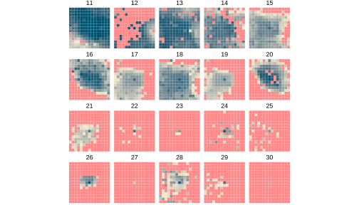
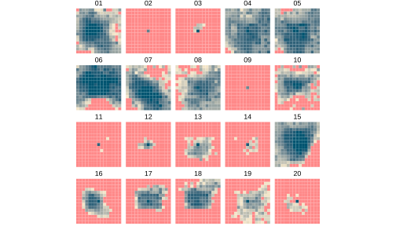
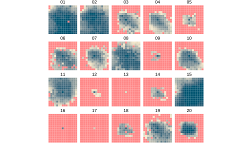
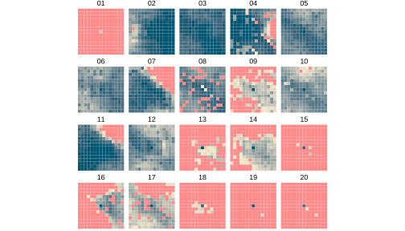

This is an annex to the [Google Maps Ranking - Proximity Study](https://frontpagedata.com/google-maps-proximity).  

# 10-Mile Grids for All Cities

We reproduced the Local Falcon grids with heat maps. Each tile is the rank of the law firm observed by Local Falcon on the 15x15 grid centered at the firm's location. The grids measure 10 miles by 10 miles. The data used to draw these grids can be found [here](https://docs.google.com/spreadsheets/d/1uOKfBcs_RgAxRf8fAlhmH8f5VLzPtf1t7enPWVT1mnM/edit?usp=sharing).   

Legend:  

The visualizations below show the grids for the 20 samples with a 10-mile radius in each city.  

### New York

### Los Angeles

### Chicago

### Miami

### Dallas

### Philadelphia

### Houston

### Atlanta

### Washington

### Boston

### Phoenix

### Seattle

### San Francisco

### Detroit

### San Diego

### Minneapolis

### Tampa

### Denver

### Brooklyn

### Queens

### Riverside

### Baltimore

### Las Vegas

### Portland

### San Antonio

### St. Louis

### Sacramento

### Orlando

### San Jose

### Cleveland

### Pittsburgh

### Austin

### Cincinnati

### Kansas City

### Indianapolis

### Columbus

### Charlotte

### Virginia Beach

### Bronx

### Milwaukee

### Providence

### Jacksonville

### Salt Lake City

### Nashville

### Richmond

### Memphis

### Raleigh

### New Orleans

### Louisville

### Oklahoma City

